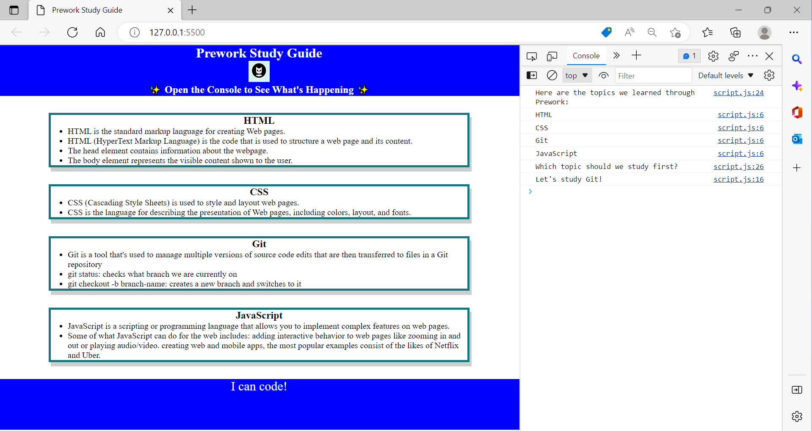

# prework-study-guide-v3

## Description

The Prework Study Guide helps to access the required tools for the boot camp course, to apply a developer mindset, use a fit version control, create basic HTML, CSS, identify a JavaScript array and deploy a static website to GitHub. 

## Installation

N/A

## Usage

To access to the topics covered in this pre-work, open the Chrome Dev Tools by presing command+Option+I (MacOS) or control+Shift+I (Windows) and press console. Please, see image. 

## Credits

N/A

## License

Please refer to the LICENSE in the repository. 

## Badges

N/A

## Features

N/A

## How to Contribute

N/A

## Tests

N/A